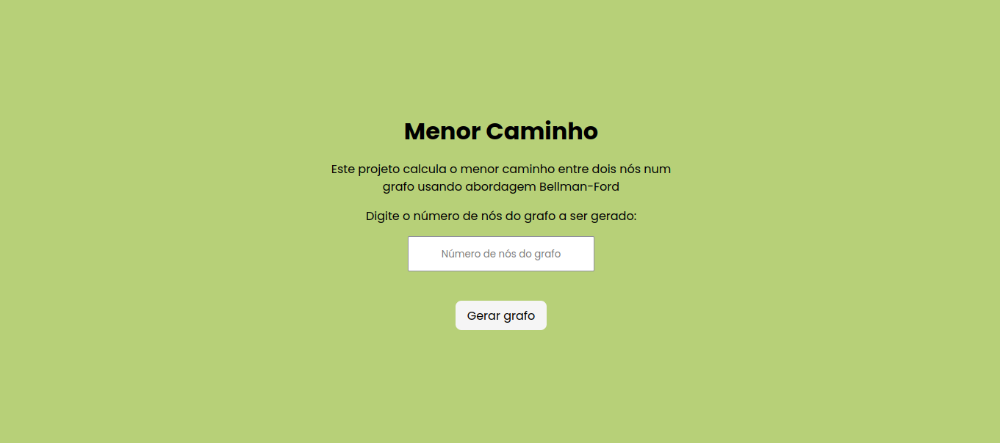
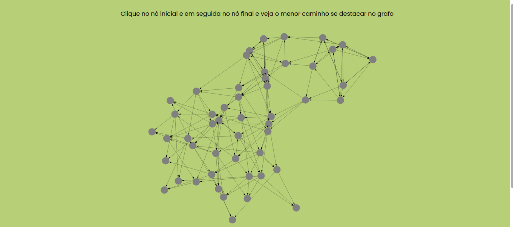

# Menor Caminho 

**Número da Lista**: 42 
**Conteúdo da Disciplina**: Trabalho Final 

## Alunos
|Matrícula | Aluno |
| -- | -- |
| 17/0045269  |  Sara Campos |

## Sobre 
Esse projeto tem como objetivo encontrar o menor caminho num grafo usando abordagem Bellman-Ford.

## Screenshots

## Instalação 
**Linguagem**: JavaScript 
**Framework**: React 

Para rodar o projeto é necessário após a clonagem do repositório e dentro da raiz do projeto rodar os seguintes comandos: 

    cd scc
    npm install
    npm start

## Uso 
Após acessar o projeto no browser, o usuário irá encontrar uma página com algumas informações e um input para o número de nós do grafo que ele deseja gerar. Em seguida, é encaminhado para a página de resultado onde ele poderá visualizar o grafo e após selecionar dois nós, poderá ver os nós do menor caminho se destacarem.

## Vídeo 
O vídeo explicando o projeto pode ser acessado através da pasta assets na raiz do projeto após a clonagem do repositório.